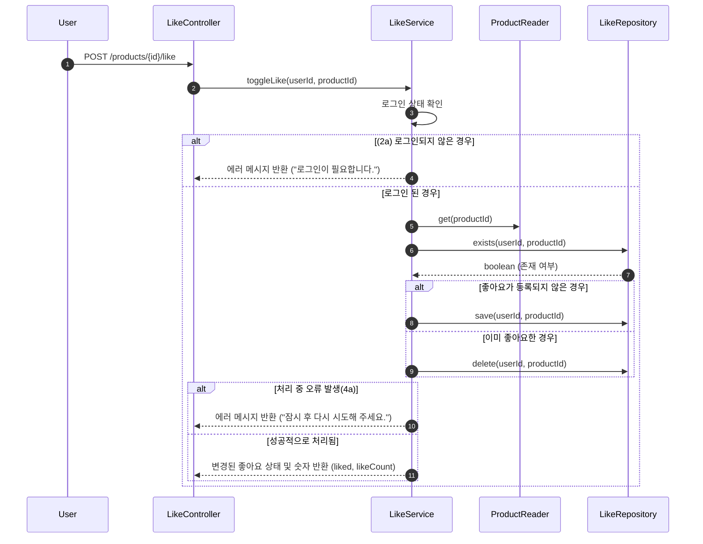
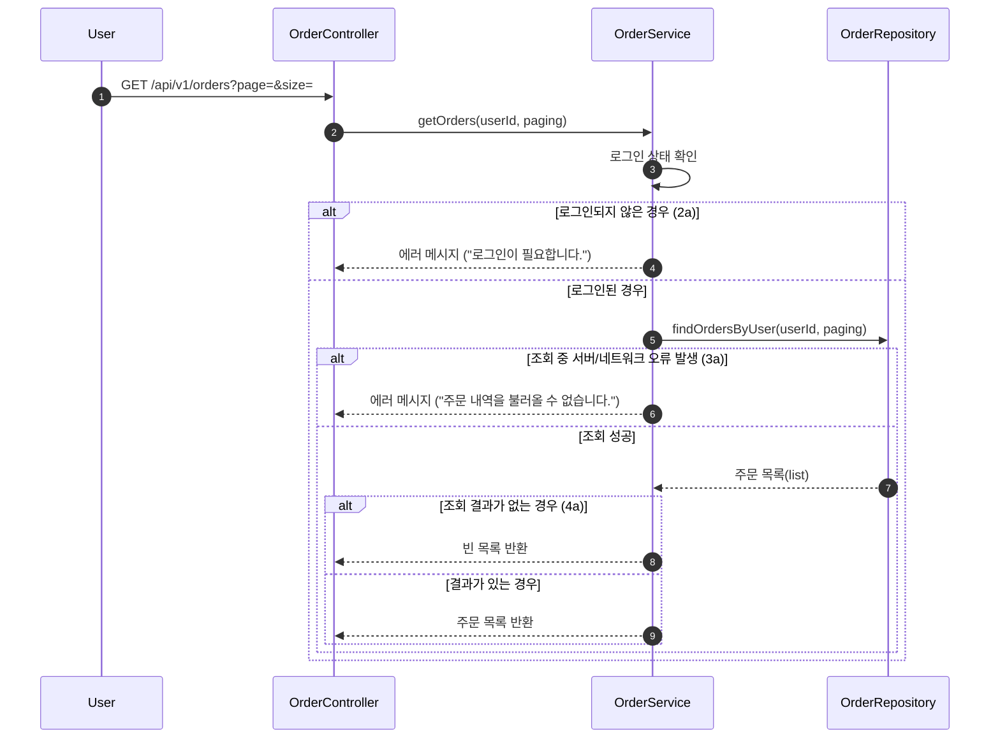

## 상품 좋아요 등록/취소

```mermaid
sequenceDiagram
    autonumber
    participant User
    participant LikeController
    participant LikeService
    participant ProductReader
    participant LikeRepository
    
    User->>LikeController: POST /products/{id}/like
    LikeController->>LikeService: toggleLike(userId, productId)
    LikeService->>LikeService: 로그인 상태 확인
    
    alt (2a) 로그인되지 않은 경우
        LikeService-->>LikeController: 에러 메시지 반환 ("로그인이 필요합니다.")
    else 로그인 된 경우
        LikeService->>ProductReader: get(productId)
        LikeService->>LikeRepository: exists(userId, productId)
        LikeRepository-->>LikeService: boolean (존재 여부)
        
        alt 좋아요가 등록되지 않은 경우
            LikeService->>LikeRepository: save(userId, productId)
        else 이미 좋아요한 경우
            LikeService->>LikeRepository: delete(userId, productId)
        end
        
        alt 처리 중 오류 발생(4a)
            LikeService-->>LikeController: 에러 메시지 반환 ("잠시 후 다시 시도해 주세요.")
        else 성공적으로 처리됨
            LikeService-->>LikeController: 변경된 좋아요 상태 및 숫자 반환 (liked, likeCount)
        end
    end
```

## 유저의 주문 목록 조회

```mermaid
sequenceDiagram
    autonumber
    participant User
    participant OrderController
    participant OrderService
    participant OrderRepository
    
    User->>OrderController: GET /api/v1/orders?page=&size=
    OrderController->>OrderService: getOrders(userId, paging)
    OrderService->>OrderService: 로그인 상태 확인
    
    alt 로그인되지 않은 경우 (2a)
        OrderService-->>OrderController: 에러 메시지 ("로그인이 필요합니다.")
    else 로그인된 경우
        OrderService->>OrderRepository: findOrdersByUser(userId, paging)
        
        alt 조회 중 서버/네트워크 오류 발생 (3a)
            OrderService-->>OrderController: 에러 메시지 ("주문 내역을 불러올 수 없습니다.")
        else 조회 성공
            OrderRepository-->>OrderService: 주문 목록(list)
            
            alt 조회 결과가 없는 경우 (4a)
                OrderService-->>OrderController: 빈 목록 반환
            else 결과가 있는 경우
                OrderService-->>OrderController: 주문 목록 반환
            end
        end
    end
```
