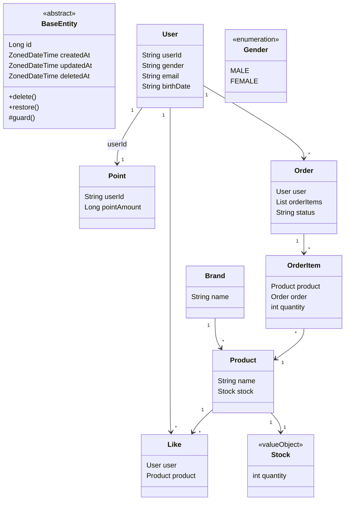

1. 모든 엔티티 테이블은 `BASE_ENTITY`의 필드를 상속 받습니다.
2. `ORDER.status`를 `VARCHAR`로 저장합니다.
3. `Point`는 별도 엔티티로 관리합니다.
4. `Stock` 클래스는 Value Object(VO)로 구현합니다.

```mermaid
classDiagram
direction TB
    class BaseEntity {
	    Long id
	    ZonedDateTime createdAt
	    ZonedDateTime updatedAt
	    ZonedDateTime deletedAt
	    +delete()
	    +restore()
	    #guard()
    }

    class User {
	    String userId
	    String gender
	    String email
	    String birthDate
    }

    class Point {
	    String userId
	    Long pointAmount
    }

    class Gender {
	    MALE
	    FEMALE
    }

    class Brand {
	    String name
    }

    class Like {
	    User user
	    Product product
    }

    class Order {
	    User user
	    List orderItems
		String status
    }

    class Product {
	    String name
	    Stock stock
    }

    class Stock {
	    int quantity
    }

    class OrderItem {
	    Product product
	    Order order
	    int quantity
    }

	<<abstract>> BaseEntity
	<<enumeration>> Gender
	<<valueObject>> Stock

    User "1" --> "1" Point : userId
    User "1" --> "*" Like
    User "1" --> "*" Order
    Brand "1" --> "*" Product
    Product "1" --> "*" Like
    Order "1" --> "*" OrderItem
    OrderItem "*" --> "1" Product
    Product "1" --> "1" Stock
```
